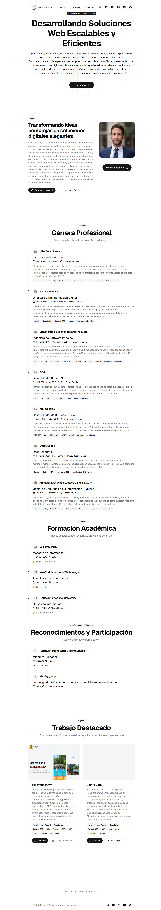

# Mario Rafael Ayala - Professional Portfolio



## Overview

A modern, responsive, and multilingual (English/Spanish) portfolio website showcasing Mario Rafael Ayala's 25+ years of experience as a software engineer. Built with Next.js 15, TypeScript, and Tailwind CSS 4.0, featuring a clean design, optimized performance, and comprehensive SEO implementation.

**Live Site:** [https://www.mariorafaelayala.com](https://www.mariorafaelayala.com)

## Tech Stack

- **Framework:** Next.js 15 (App Router)
- **Language:** TypeScript
- **Styling:** Tailwind CSS 4.0, Shadcn UI
- **State Management:** React Context API
- **Animations:** Custom animation components
- **Deployment:** Vercel
- **Analytics:** Vercel Analytics
- **SEO:** Next.js Metadata API, structured data
- **Internationalization:** Custom i18n implementation
- **Icons:** Lucide React

## Features

- 🌐 **Bilingual Support** - Full English and Spanish translations with language switcher
- 🎨 **Modern UI Design** - Clean, professional interface with animations and transitions
- 📱 **Fully Responsive** - Optimized for all device sizes (mobile, tablet, desktop)
- 🌙 **Dark Mode** - Support for light and dark themes
- 🔍 **SEO Optimized** - Metadata, Open Graph, Twitter Cards, structured data
- 📊 **Analytics Integration** - Vercel Analytics for visitor insights
- 🚀 **Performance Optimized** - Image optimization, code splitting, static generation
- 🔄 **Language Persistence** - Remembers user language preference
- 📃 **Downloadable Resume** - Language-specific resume downloads
- 🔗 **Social Media Integration** - Links to GitHub, LinkedIn, YouTube, WhatsApp, Email
- 🖼️ **Project Showcase** - Highlighted portfolio projects with descriptions and tech stacks
- ⚡ **Fast Page Loads** - Optimized build and performance metrics
- 🔐 **TypeScript Safety** - Full type coverage for robust code quality

## Getting Started

### Prerequisites

- Node.js 18.17.0 or later
- pnpm (recommended) or npm

### Installation

1. Clone the repository:

```bash
git clone https://github.com/yourusername/mario-rafael-ayala-portfolio.git
cd mario-rafael-ayala-portfolio
```

2. Install dependencies:

```bash
pnpm install
```

3. Start the development server:

```bash
pnpm dev
```

4. Open [http://localhost:3000](http://localhost:3000) in your browser to see the result.

## Project Structure

```
├── app/                    # Next.js App Router components
│   ├── globals.css         # Global styles
│   ├── layout.tsx          # Root layout with metadata
│   ├── page.tsx            # Home page
│   ├── manifest.ts         # PWA manifest
│   ├── robots.ts           # Robots configuration
│   └── sitemap.ts          # Sitemap generator
├── components/             # Reusable UI components
│   ├── about.tsx           # About section
│   ├── experience.tsx      # Experience section
│   ├── footer.tsx          # Site footer
│   ├── hero.tsx            # Hero section
│   ├── language-switcher.tsx # Language toggle
│   ├── navbar/             # Navigation components
│   ├── projects.tsx        # Projects section
│   └── ui/                 # Shadcn UI components
├── lib/                    # Utility functions
│   ├── contexts/           # React contexts
│   ├── i18n.ts             # Internationalization setup
│   ├── schema.ts           # Schema.org structured data
│   ├── seo-config.ts       # SEO configuration
│   └── utils.ts            # Helper functions
├── public/                 # Static assets
├── content/                # (Optional) Static content files
├── next.config.ts          # Next.js configuration
├── postcss.config.mjs      # PostCSS configuration
├── tailwind.config.js      # Tailwind CSS configuration
├── tsconfig.json           # TypeScript configuration
└── package.json            # Project dependencies
```

## SEO Implementation

This portfolio implements comprehensive SEO optimizations including:

- **Metadata API** - Title, description, keywords, and OpenGraph tags in layout.tsx
- **Structured Data** - Schema.org markup for personal information
- **Semantic HTML** - Properly structured HTML with appropriate heading hierarchy
- **Performance** - Optimized for Core Web Vitals
- **Sitemap** - Automatically generated sitemap
- **Robots.txt** - Custom robots configuration
- **Canonical URLs** - Proper canonical URL implementation
- **Alt Text** - Accessible images with descriptive alt text
- **Meta Tags** - Language, viewport, and other important meta tags
- **Social Sharing** - OpenGraph and Twitter Card support

## Internationalization

The site implements a custom internationalization system using:

- React Context API for language state management
- Local storage for language preference persistence
- Separate translation files for English and Spanish
- Dynamic content loading based on selected language
- Language detection and switching functionality

## Performance Optimizations

- **Image Optimization** - Next.js Image component with proper sizing and formats
- **Code Splitting** - Automatic code splitting by route
- **Font Optimization** - Optimized font loading with next/font
- **CSS Optimization** - Using Tailwind's JIT compiler
- **Static Generation** - Where appropriate for faster page loads
- **Dynamic Imports** - For components not needed on initial load

## Deployment

The site is deployed on Vercel, which provides:

- Continuous deployment from GitHub
- Edge functions and CDN distribution
- Analytics and monitoring
- Automatic HTTPS and SSL certificates
- Environment variable management

## Development Practices

This project follows these development best practices:

- TypeScript for type safety
- ESLint for code quality
- Prettier for consistent formatting
- Component-based architecture
- Atomic design principles
- Responsive design methodology
- Accessibility considerations
- SOLID principles adapted to functional programming

## License

MIT © Mario Rafael Ayala

## Acknowledgments

- Built with [Next.js](https://nextjs.org/)
- UI components from [shadcn/ui](https://ui.shadcn.com)
- Icons from [Lucide](https://lucide.dev/)
- Deployed on [Vercel](https://vercel.com)
